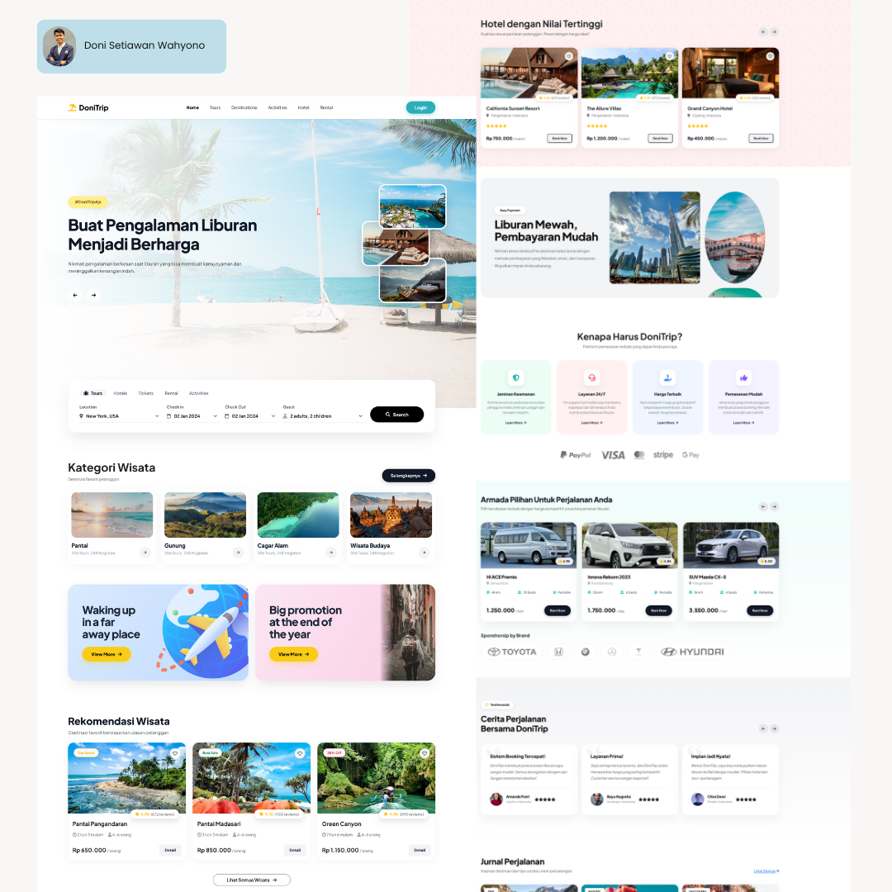
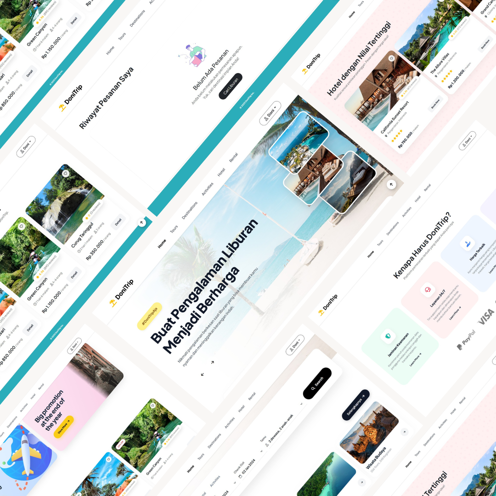
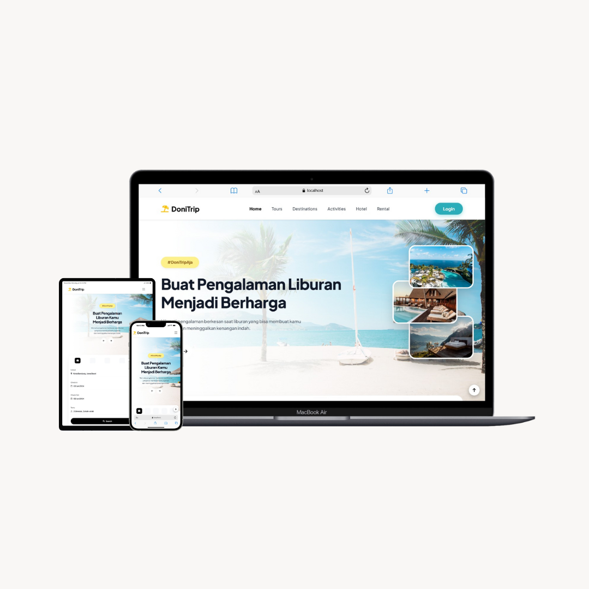

# 🏖️ DoniTrip - Modern Travel Booking Platform

  
  
  

**DoniTrip** adalah aplikasi web pemesanan tiket wisata berbasis **MVC (Model-View-Controller)** yang dibangun dengan PHP Native. Proyek ini dirancang dengan pendekatan *Mobile-First Design*, menawarkan pengalaman pengguna yang mulus dari pencarian destinasi hingga proses pembayaran.

## 🌟 Fitur Utama

### 📱 Frontend (User Interface)
* **Responsive Mobile-First Design:** Tampilan yang optimal di Desktop, Tablet, dan Smartphone.
* **Interactive UI:** Fitur *Auto-scroll* dan *Swipeable Cards* pada kategori dan rekomendasi wisata.
* **Smart Search:** Pencarian paket wisata dengan filter lokasi dan tanggal.
* **Smooth Transitions:** Animasi perpindahan halaman yang halus (App-like experience).

### 🛒 Backend & Transaksi
* **Sistem Autentikasi:** Login & Register aman dengan *Password Hashing*.
* **Shopping Cart:** Menambahkan paket wisata dan hotel ke keranjang belanja.
* **Checkout System:** Formulir pemesanan lengkap dengan validasi data pelanggan.
* **User Dashboard:** Riwayat pesanan status pembayaran real-time.

### 🛠️ Admin Panel (CMS)
* **Dashboard Admin:** Ringkasan data sistem.
* **Kelola Transaksi:** Melihat semua pesanan masuk dan update status pembayaran (Pending/Paid/Cancel).
* **Kelola Wisata (CRUD):** Tambah, Edit, dan Hapus paket wisata secara dinamis.

### 🔌 API Support
* Menyediakan **REST API** (JSON) untuk integrasi dengan aplikasi mobile (Postman Ready).
* Endpoint: `/api/tours`, `/api/hotels`, `/api/login`.

---

## 💻 Teknologi yang Digunakan

* **Bahasa:** PHP 8 (Native MVC OOP)
* **Database:** MySQL / MariaDB
* **Frontend:** Bootstrap 5.3, Custom CSS3, Vanilla JavaScript
* **Tools:** Visual Studio Code, XAMPP, Postman

---

## 👤 Tentang Pengembang

Project ini dibuat dengan ❤️ oleh:

**Doni Setiawan Wahyono**
* **Role:** Mobile Application Developer
* **Kampus:** Universitas Teknologi Bandung
* **NPM:** 23552011146

